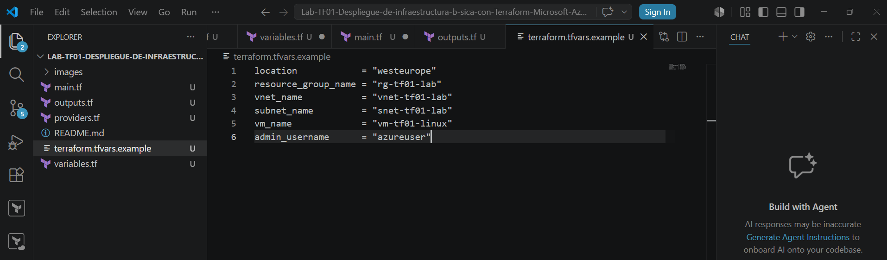
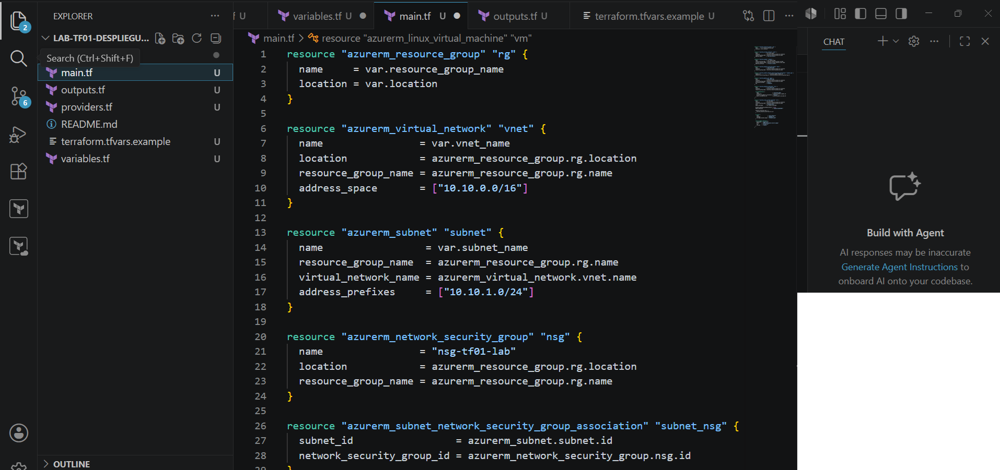
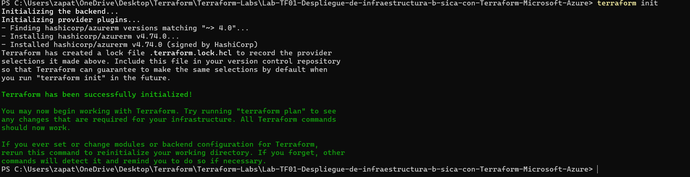
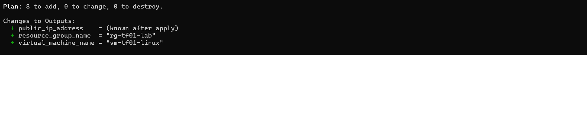
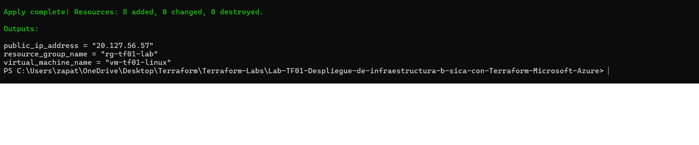
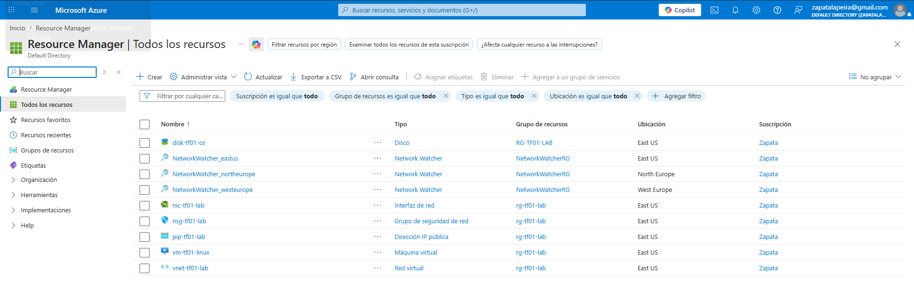
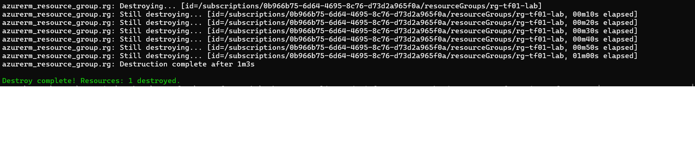

# Lab TF-01 — Despliegue de infraestructura básica con Terraform | Microsoft Azure

## Contexto (por qué lo hice)
Terraform permite desplegar infraestructura en Azure mediante código, evitando crear los recursos manualmente desde el portal.

En este lab implemento un escenario básico: una red virtual con subred, un grupo de seguridad de red y una máquina virtual Linux.

La idea es practicar el ciclo básico de Terraform y demostrar cómo se puede crear infraestructura de Azure de forma automatizada.

## Objetivo
Desplegar una infraestructura básica en Azure usando **Terraform**:
- Crear un **Resource Group**
- Crear una **Virtual Network**
- Crear una **Subnet**
- Crear un **Network Security Group**
- Crear una **Public IP**
- Crear una **Network Interface**
- Desplegar una **Linux Virtual Machine**
- Validar los recursos creados desde el portal de Azure
- Eliminar la infraestructura con `terraform destroy` para evitar costes

---

## Alcance y configuración
- **Herramienta utilizada:** Terraform
- **Provider:** AzureRM
- **Cloud:** Microsoft Azure
- **Tipo de despliegue:** Infrastructure as Code
- **Sistema operativo VM:** Linux
- **Recursos temporales:** Sí, se eliminan al finalizar el laboratorio

---

## Tareas realizadas
1. Creación de la estructura del laboratorio en el repositorio.
2. Configuración del provider `azurerm`.
3. Definición de los recursos principales en Terraform.
4. Ejecución de `terraform init`.
5. Ejecución de `terraform plan`.
6. Ejecución de `terraform apply`.
7. Validación de los recursos desde el portal de Azure.
8. Eliminación de los recursos con `terraform destroy`.

---

## Evidencias

### 1) Estructura del laboratorio
Carpeta del laboratorio con los ficheros principales de Terraform y la carpeta de imágenes.

**Ficheros creados:**
- `providers.tf`
- `main.tf`
- `variables.tf`
- `outputs.tf`
- `terraform.tfvars.example`
- `README.md`
- `images/`

---

### 2) Código Terraform del despliegue
Configuración de Terraform donde se definen los recursos principales del laboratorio.

**Recursos definidos:**
- Resource Group
- Virtual Network
- Subnet
- Network Security Group
- Public IP
- Network Interface
- Linux Virtual Machine

---

### 3) Inicialización de Terraform
Ejecución de `terraform init` para inicializar el directorio de trabajo y descargar el provider de Azure.

---

### 4) Plan de despliegue
Ejecución de `terraform plan` para revisar los recursos que Terraform va a crear antes de aplicarlos.

---

### 5) Aplicación del despliegue
Ejecución de `terraform apply` para crear los recursos definidos en Azure.

---

### 6) Recursos creados en Azure
Validación desde el portal de Azure de los recursos creados por Terraform dentro del grupo de recursos.

---

### 7) Eliminación de la infraestructura
Ejecución de `terraform destroy` para eliminar los recursos creados y evitar costes innecesarios.

---

## Checklist de verificación
- [x] Estructura del laboratorio creada
- [x] Código Terraform definido
- [x] Provider AzureRM inicializado
- [x] Plan de despliegue revisado
- [x] Recursos creados con `terraform apply`
- [x] Recursos validados desde el portal de Azure
- [x] Infraestructura eliminada con `terraform destroy`

---

## Resultado final
Se ha desplegado una infraestructura básica en Microsoft Azure utilizando Terraform.

Este laboratorio demuestra el uso práctico de **Infrastructure as Code** para crear recursos de Azure de forma automatizada y controlada.
